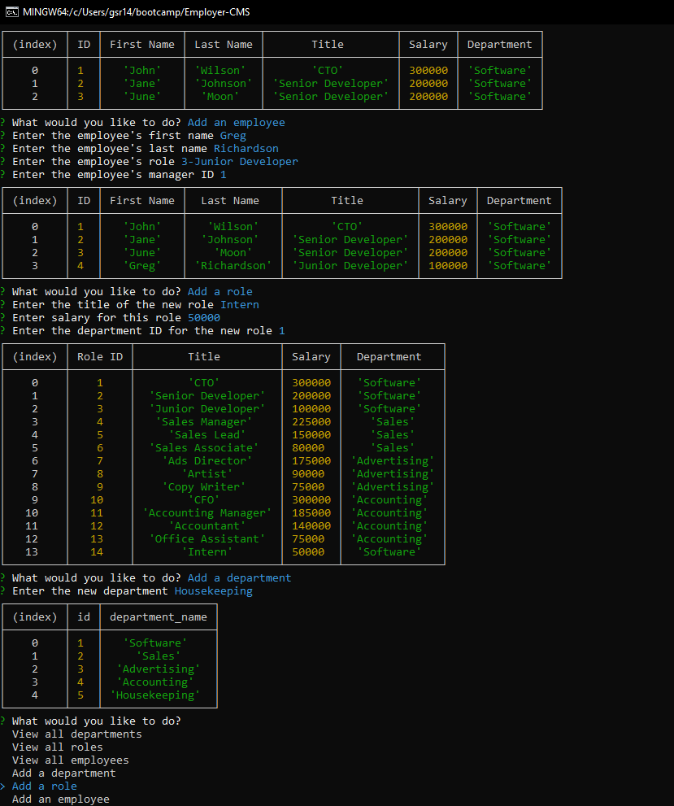

# Employer-CMS

## Table of Contents:
1. [Description](#description)
2. [Installation](#installation)
3. [Usage](#usage)
4. [Contributions](#contributions)
5. [Demo](#demo)
6. [License](#license)
7. [Technologies Used](#technology)
8. [GitHub](#github)
9. [Email](#email)
  
  
## Description
An application that runs from the Command Line, this allows an employer to track and update departments, roles, and employees. This is done using a MySQL database for data storage, and Inquirer to prompt the user for information. The data displays as a table in the Command Line.

## Installation
First, ensure that NodeJS and MySQL are installed on your machine. Clone the repository to your machine. Open a command line in the program's root directory and type 'npm install' to install the program dependencies. Installation is now complete.

## Usage
Log into MySQL, and create the database by typing 'source db/schema.sql;'. Type 'quit' to exit MySQL, then type 'node index.js'. This opens the application. Follow the prompts to view departments, roles, and employees, as well as adding to each of these categories and updating employees.

## Contributions
Create a pull request or contact me through GitHub or Email.

## Demo
View a demo of the application [here](https://watch.screencastify.com/v/PMnwuLCTtXTiJ0ZwnBj0).

## License
 

## Technologies Used
* [JavaScript](https://developer.mozilla.org/en-US/docs/Web/JavaScript)
* [NodeJS](https://nodejs.org/en)
* [Inquirer](https://www.npmjs.com/package/inquirerm)
* [MySQL](https://www.mysql.com/)

## Questions
For qestions about the project you can contact me at

### Github
[gsr142](https://github.com/gsr142)

### Email
[gsr142@gmail.com](gsr142@gmail.com)